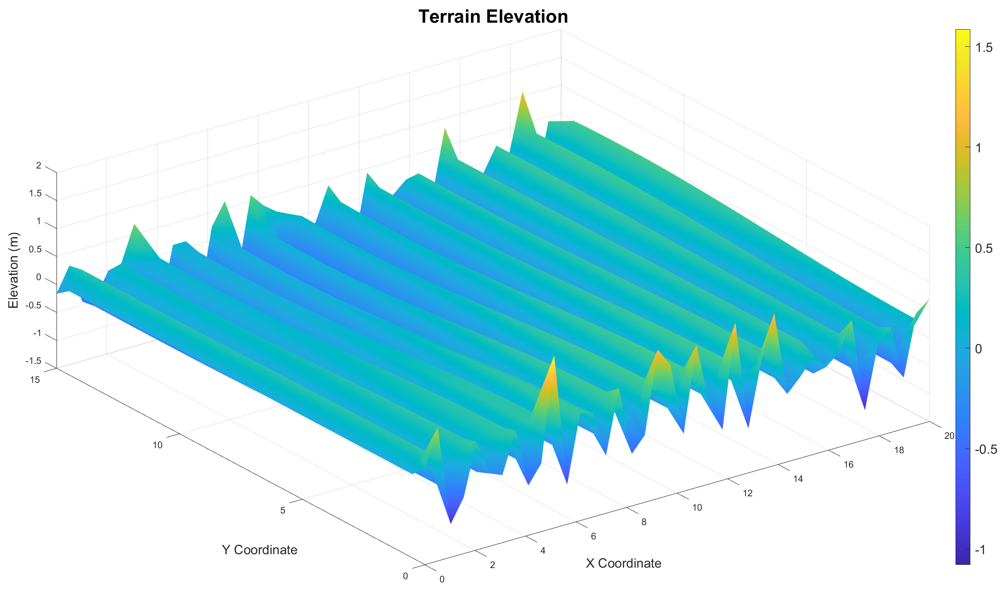
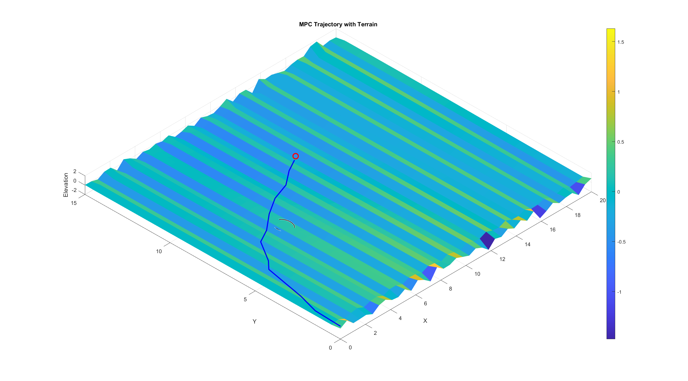
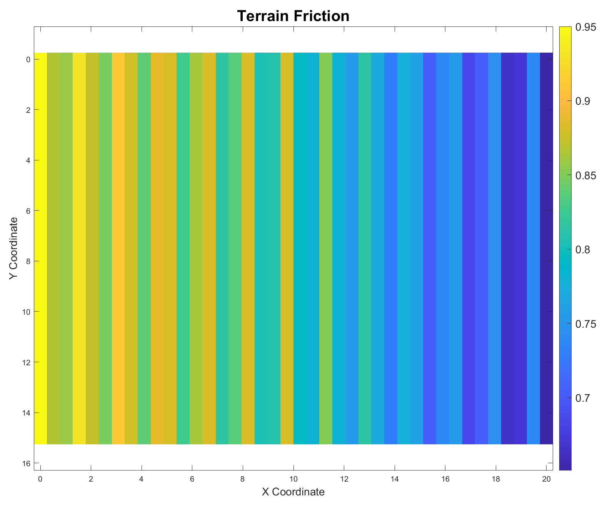

# Model Predictive Control Project

This repository contains MATLAB code and resources for experimenting with a model predictive control (MPC) approach to autonomous robot navigation over uneven agricultural terrain with obstacles. The project generates a terrain map with friction and elevation effects and solves an optimal control problem to drive a robot to a target while avoiding obstacles.

## Repository Structure

- `main.m` – Entry point that sets up the terrain, initial state, goal location and obstacles, then runs the MPC demo and visualizes the result in 3‑D.
- `agricultural_MPC2.m` – Implements the MPC loop. At each iteration it computes an optimal control sequence using `optimize_control_sequence.m`, applies the first input, and simulates the robot using `robot_dynamics2.m`.
- `optimize_control_sequence.m` – Builds a control sequence by minimizing a cost function with `fmincon`. The cost function encourages progress toward the goal while keeping distance from obstacles.
- `optimize_control2.m` – Variant that solves a single‑step optimization problem.
- `robot_dynamics2.m` – Simulates the robot considering terrain elevation and friction, producing the next state from a control input.
- `obstacle_proximity_cost2.m` – Computes a penalty when the robot approaches obstacles.
- `Terrain_Visualization.m` – Script that plots the generated terrain elevation and friction maps.
- `Images/` – Example figures produced by the simulation.
- `Final_Project_Report.pdf` – Report describing the methodology and results of this MPC approach.

## Requirements

The code is written for MATLAB and requires the Optimization Toolbox (for `fmincon`) and the Image Processing Toolbox for `viscircles`.

## Running the Example

1. Launch MATLAB.
2. Add the repository folder to the MATLAB path.
3. Execute `main.m`. The script creates a terrain map, configures obstacles, and runs the MPC controller. A 3‑D plot shows the predicted trajectory, goal position and obstacles.

For a standalone view of the terrain maps you can run `Terrain_Visualization.m`.

## Results

The `Final_Project_Report.pdf` document illustrates various example scenarios and
terrain maps generated by the MPC pipeline. A few representative screenshots are
shown below.

## Customization

- **Changing the terrain** – Modify the elevation and friction parameters in `main.m` or `Terrain_Visualization.m`.
- **Obstacles and goal** – Edit the `obstacles` matrix and the `goal` vector in `main.m` to place objects or specify a different destination.
- **MPC horizon** – Adjust `N` in `main.m` to change the prediction horizon.

## References

For a detailed explanation of the model, cost functions, and tuning parameters see `Final_Project_Report.pdf`.

